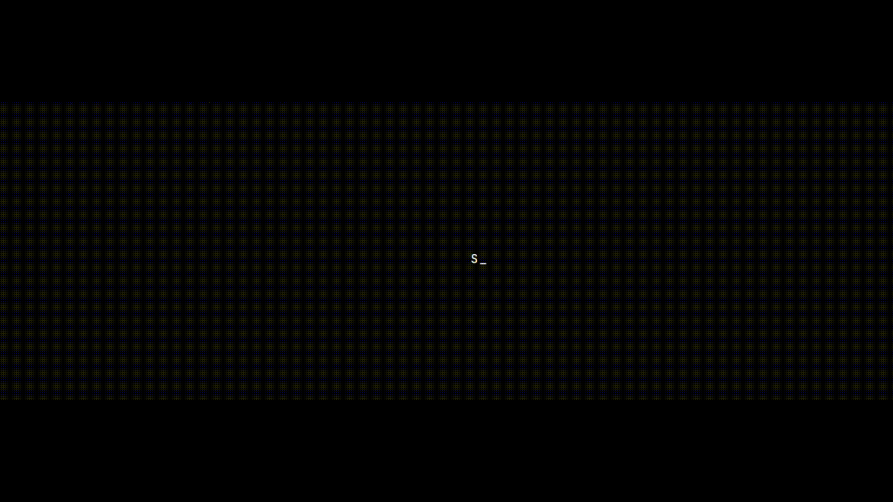

         
    
\

   
\


# Description

Terminal Perso est mon espace personnel, un terminal virtuel qui reflète mon univers tech et ferroviaire.

Ce projet sert à centraliser mes notes, mes projets, mes idées, et mes expérimentations, dans une interface inspirée des consoles de commande classiques, avec une ambiance visuelle sobre, futuriste et fonctionnelle.

Il est pensé pour être à la fois un carnet de bord numérique et un laboratoire d’apprentissage, mêlant code, design et storytelling.

## Technologies utilisées :

-  HTML 5
-  CSS 3
-  Javascript
-  GIT
-  GitHub Pages

# Fonctionnalités :

- 🖥️ **Design Rétro-Minimaliste :** Interface interactive inspirée des terminaux d'antan, conçue pour un affichage sur un écran de bureau.
- 📱 **Version Mobile Responsive :** Adaptation de la maquette pour les smartphones, en utilisant des **Media Queries** pour une expérience utilisateur fluide sur tous les écrans.
- 🧭 **Navigation JavaScript :** Utilisation de JavaScript vanilla (JS pur, sans librairie) pour une navigation dynamique, avec un système de fenêtres pop-up qui s'ouvrent au clic sur chaque icône.
- 🕶️ **Accessibilité (A11Y) :** Utilisation d'attributs ARIA pour améliorer l'expérience des utilisateurs de lecteurs d'écran.

# Détails du code :

Le code a été structuré pour être facile à lire et à maintenir. Voici un aperçu des technologies et des bonnes pratiques utilisées :
- **HTML sémantique :** L'utilisation de balises HTML pertinentes (comme `<main>`, `<section>`, etc.) permet une meilleure accessibilité et une structure de page claire pour les navigateurs et les lecteurs d'écran.
- **CSS modulaire :** Les styles sont organisés dans des fichiers distincts (`variables.css`, `style.css`, `intro.css`, `popup.css`), ce qui facilite leur gestion. L'utilisation de variables CSS permet de centraliser et de modifier facilement les couleurs, les polices et les ombres.
- **JavaScript Vanilla :** Le code JavaScript est écrit en JS pur, sans dépendance à des librairies externes. Le découpage en modules (`index.js`, `intro.js`, `popup.js`, `data.js`) rend le code plus lisible et réutilisable.

## Structure du projet :

```plaintext
.
├── assets/                     # Fichiers statiques (images, polices, styles)
│   ├── fonts/
│   ├── img/
│   └── scripts/                # Scripts JS
│       ├── intro.js            # Script pour l'animation d'introduction
│       ├── popup.js            # Script pour la gestion des fenêtres pop-up
│       ├── index.js            # Fichier JavaScript principal
│       └── data.js             # Contenu dynamique des pop-ups
│   └── styles/                 # Feuilles de styles CSS
│       ├── intro.css           # Styles pour l'animation d'introduction
│       ├── popup.css           # Styles pour la fenêtre pop-up
│       ├── style.css           # Styles principaux du site
│       └── variables.css       # Variables CSS globales
├── index.html                  # Page principale du site
```

# Aperçu

Voici un aperçu du projet, que tu peux visualiser en ligne sur GitHub Pages :


## Lien vers le site en ligne

Tu peux consulter la version en ligne de ce projet via GitHub Pages en cliquant sur le lien suivant :
[Voir le site sur GitHub Pages](https://jhauck67.github.io/jhauck67/)

# A faire :

- [ ] Modification de la section #blog et ajout d'un lien vers la page blog

# Auteur :

Jhauck67 (Développeuse web)

# Liens utiles :

[Portfolio de Jennifer](https://jhauck67.github.io/jhauck67/)  
[Voir le site en ligne](https://jhauck67.github.io/jhauck67/)
